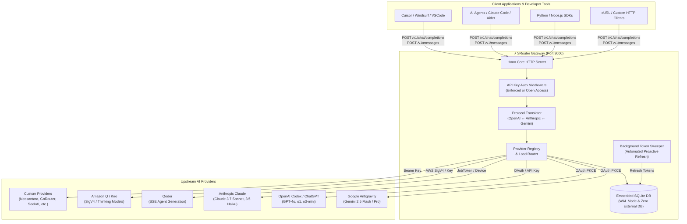

<div align="center">

# ⚡ SRouter

**High-Performance Multi-Provider AI Gateway & Intelligent LLM Proxy Router**

_Unify OpenAI, Anthropic Claude, Google Antigravity, Qoder, Kiro, and custom AI providers under a single, ultra-fast, local-first API._

<br/>

[](https://github.com/seaavey/SRouter/releases)
[](LICENSE)
[](https://nodejs.org/)
[](https://www.typescriptlang.org/)
[](https://hono.dev/)
[](https://react.dev/)
[](https://turbo.build/)
[](https://sqlite.org/)
[](https://ghcr.io/seaavey/srouter)
[](.github/workflows/ci.yml)

<br/>

[Key Features](#-key-features) • [Why SRouter?](#-why-srouter) • [Architecture](#-architecture) • [Performance](#-performance--benchmarks) • [Supported Providers](#-supported-providers) • [Quick Start](#-quick-start) • [Docker Deployment](#-docker-deployment) • [Client Integration](#-client-integration) • [API Reference](#-api-reference) • [Configuration](#-configuration) • [Contributing](#-contributing)

</div>

---

## 📖 Overview

**SRouter** is an ultra-fast, lightweight, local-first LLM API Gateway and proxy router engineered with **TypeScript**, **[Hono](https://hono.dev/)**, and native embedded **SQLite WAL** (`node:sqlite`).

Modern AI development often requires juggling multiple providers, varying API schemas, fragmented rate limits, and short-lived OAuth credentials. SRouter eliminates this complexity by unifying upstream AI providers—including **Google Antigravity**, **OpenAI Codex / ChatGPT**, **Anthropic Claude**, **Qoder**, **Amazon Q / Kiro**, **Neosantara**, and custom endpoints—under a **standardized, drop-in OpenAI (`/v1/chat/completions`) and Anthropic (`/v1/messages`) interface**.

Equipped with an embedded OAuth token refresh daemon, real-time quota telemetry, virtual API key isolation, and a modern React 19 web dashboard, SRouter provides a complete, self-hosted AI gateway solution with zero external database dependencies.

---

## 🎯 Why SRouter?

| Challenge without SRouter                                                                                                               | Solution with SRouter                                                                                                                              |
| :-------------------------------------------------------------------------------------------------------------------------------------- | :------------------------------------------------------------------------------------------------------------------------------------------------- |
| **Fragmented API Standards**: Switching between OpenAI, Anthropic, and Gemini schemas requires rewriting SDK client code.               | **Unified Standard APIs**: 100% compliant OpenAI `/v1/chat/completions` and Anthropic `/v1/messages` endpoints with bidirectional translation.     |
| **OAuth Token Expiration**: Browser-based OAuth sessions (Google PKCE, Codex, Qoder) expire frequently and disrupt automated workflows. | **Autonomous Background Sweeper**: Built-in background daemon refreshes OAuth tokens automatically before expiration without interrupting traffic. |
| **Hidden Rate Limits & Quotas**: Upstream rate limits fail silently or unpredictably during peak workloads.                             | **Live Quota Telemetry**: Real-time percentage meters, reset countdown timers, and visual status alerts (`ok`, `warning`, `exhausted`).            |
| **Heavy Gateway Overhead**: Traditional proxies require Redis, PostgreSQL, Docker clusters, and consume gigabytes of memory.            | **Zero-Dependency Core**: Powered by Hono and native `node:sqlite` in WAL mode with instant boot time and near-zero memory footprint.              |
| **Lack of Visibility**: Hard to trace model latency, token costs, or debug streaming issues across tools.                               | **Built-in Dashboard & Studio**: Modern React 19 dashboard with interactive Playground, thinking/reasoning visualization, and audit logs.          |

---

## 🌟 Key Features

### 🔀 Unified Protocol Routing & Streaming

- **Drop-in OpenAI & Anthropic API**: Compatible with all OpenAI and Anthropic SDKs, Cursor, Windsurf, Claude Code, Cline, Roo Code, Aider, and custom pipelines.
- **Bi-Directional Schema Translation**: Automatic conversion between OpenAI JSON schemas, Claude tool calls, and Gemini reasoning protocols.
- **True SSE Streaming**: Native Server-Sent Events streaming with real-time chunk normalization and usage metrics.

### 🛡️ Circuit Breakers, Smart Fallbacks & Meta-Routing (`srouter/auto`)

- **Autonomous Circuit Breaker**: Real-time account health monitoring, error pattern detection (`429`, `403`, `502`, `503`, quota exhaustion), and automatic cooldown recovery.
- **Tiered Multi-Account Failover**: Seamlessly shifts traffic across multiple accounts registered to the same provider when rate limits occur.
- **Smart Cross-Provider Fallback Cascades**: Configurable rule-based fallbacks (exact, wildcard prefix, or global) that re-route downstream requests before the first SSE chunk is emitted.
- **Smart Meta-Routing (`srouter/auto` & `auto`)**: Built-in intelligent routing that automatically dispatches requests to the highest-ranked healthy model available in your pool.

### 🔄 Autonomous OAuth PKCE & Token Sweeper

- **Automated Lifecycle Management**: Embedded background daemon continuously monitors and refreshes OAuth tokens (Google Antigravity, OpenAI Codex, Qoder) before they expire.
- **Local PKCE Auth Flow**: Built-in callback server on port `1455` for friction-free authentication right from the dashboard.

### 📊 Real-Time Upstream Quota & Telemetry (`/v1/quota`)

- **Live Rate Limit Monitoring**: Track remaining capacity, token limits, and upstream reset schedules.
- **Visual Status Signals**: Immediate feedback on quota health (`ok`, `warning`, `exhausted`) to prevent sudden workflow interruptions.

### 🔑 Virtual API Keys & Granular Security (`/v1/keys`, `/v1/settings`)

- **Scoped Virtual Keys**: Generate custom client keys (`sr-live-...`) with custom expiration, rate limits, and usage quotas.
- **Flexible Security Modes**: Toggle between **Enforce API Key** (HTTP 401 on unauthenticated requests) for production and **Open Access** for local development.

### 🧪 Interactive Web Playground & Model Studio (`/playground`)

- **Real-Time Testing**: Test any connected provider model with streaming SSE, adjustable temperature/parameters, and session history.
- **Reasoning / Thinking Inspector**: Dedicated UI panels to inspect thinking processes from models like Gemini 2.5 Flash/Pro Thinking, o1/o3-mini, and Claude 3.7 Sonnet.
- **Code Export**: One-click code generation for Python, TypeScript, and cURL.

### 🎨 Modern Minimalist Dashboard

- **React 19 & TanStack Router**: Ultra-responsive SPA built with Vite, TanStack Router, and TanStack Table.
- **Tailwind CSS v4 & Dark Mode**: Fluid layout with responsive Light/Dark themes and smooth View Transitions.
- **Full Audit Logging**: Searchable request audit logs with latency breakdowns, token consumption, and cost calculations.

---

## 🏛 Architecture



---

## ⚡ Performance & Benchmarks

SRouter is engineered for peak efficiency with **Hono** and embedded **SQLite WAL**, maintaining an exceptionally small memory footprint and instant cold boot times compared to alternative AI gateways.

### 📊 Memory Footprint Comparison (0 — 250 MB Scale)

```text
Memory Footprint (Idle Production Runtime)
───────────────────────────────────────────────────────────────────────────────────────
SRouter API (API-only)    [█████████░░░░░░░░░░░░░░░░░░░░░░░░░]  27%   65.2 MiB  (≈68 MB)  ⚡ Best
9router (API-only)        [██████████████░░░░░░░░░░░░░░░░░░░░]  44%  104.5 MiB (≈110 MB)
SRouter (API + Dashboard) [███████████████████████████░░░░░░░]  86%  206.1 MiB (≈216 MB)
OmniRoute                 [──────────────────────────────────]   —    N/A (Build Incomplete)
───────────────────────────────────────────────────────────────────────────────────────
```

| Gateway Engine                   |   Memory Usage (RAM)    |     Scale (250 MB)     | Status Build & Runtime                  |
| :------------------------------- | :---------------------: | :--------------------: | :-------------------------------------- |
| ⚡ **SRouter API (API-only)**    |  **65.2 MiB** (~68 MB)  | `~27%` _(Highlighted)_ | ✅ Production build/start successful    |
| 🏢 **9router (API-only)**        | **104.5 MiB** (~110 MB) |         `~44%`         | ✅ Production build/start successful    |
| 🖥️ **SRouter (API + Dashboard)** | **206.1 MiB** (~216 MB) |         `~86%`         | ✅ API + Vite preview dashboard         |
| ⚠️ **OmniRoute**                 |          **—**          |         _N/A_          | ❌ Production build/start not completed |

> [!NOTE]
> Measurements taken on production Node.js v22/v24 runtime under standard idle state. SRouter's standalone API mode consumes only **~65 MiB**, making it ideal for low-spec VPS, Raspberry Pi, and resource-constrained edge deployments.

---

## 🌐 Supported Providers

SRouter supports a wide range of official and community AI providers out of the box:

| Provider                   | Auth Type            | Model Prefix     | Streaming (SSE) |   Reasoning / Thinking    |  Quota Sync  |
| :------------------------- | :------------------- | :--------------- | :-------------: | :-----------------------: | :----------: |
| **Google Antigravity**     | OAuth 2.0 PKCE       | `antigravity/*`  |       ✅        | ✅ (Flash / Pro Thinking) |      ✅      |
| **OpenAI Codex / ChatGPT** | OAuth 2.0 PKCE       | `openai_codex/*` |       ✅        |     ✅ (o1, o3-mini)      |      ✅      |
| **Anthropic Claude**       | API Key / OAuth      | `anthropic/*`    |       ✅        |      ✅ (3.7 Sonnet)      |      ✅      |
| **Qoder**                  | Device Token / OAuth | `qoder/*`        |       ✅        |            ✅             |      ✅      |
| **Amazon Q / Kiro**        | AWS SigV4 / API Key  | `kiro/*`         |       ✅        |   ✅ (Thinking Suffix)    |      ✅      |
| **Neosantara**             | Bearer API Key       | `neosantara/*`   |       ✅        |            ✅             |      ✅      |
| **GoRouter**               | Bearer API Key       | `gorouter/*`     |       ✅        |            ✅             |      ✅      |
| **BluesMinds**             | Bearer API Key       | `bluesminds/*`   |       ✅        |            ✅             |      ✅      |
| **SeekAI**                 | Bearer API Key       | `seekai/*`       |       ✅        |            ✅             |      ✅      |
| **TabiToken**              | Bearer API Key       | `tabitoken/*`    |       ✅        |            ✅             |      ✅      |
| **Command Code**           | Bearer API Key       | `commandcode/*`  |       ✅        |            ✅             |      ✅      |
| **Custom Endpoints**       | Custom Bearer / URL  | `custom/*`       |       ✅        |       Configurable        | Configurable |

---

## 🚀 Quick Start

### Prerequisites

- **Node.js**: `v22.0.0+` or `v24.0.0+`
- **pnpm**: `v10.0.0+` (`corepack enable pnpm`)

### 1. Clone & Install

```bash
git clone https://github.com/seaavey/SRouter.git
cd SRouter
pnpm install
```

### 2. Configure Environment

Copy the example environment file (the defaults work out of the box):

```bash
cp .env.example .env
```

### 3. Start Development Servers

```bash
pnpm dev
```

The stack boots with live hot-reloading:

- **API Gateway**: `http://localhost:3000`
- **Web Dashboard**: `http://localhost:5173`
- **OAuth Callback Server**: `http://localhost:1455`

### 4. Connect Your Providers

1. Open `http://localhost:5173` in your browser.
2. Navigate to **Providers** and authenticate your accounts (OAuth or API keys).
3. Generate a Virtual API key in **API Keys** (optional if Open Access is enabled).
4. Jump into the **Playground** to start chatting!

---

## 🐳 Docker Deployment

Run SRouter anywhere with Docker or Docker Compose in seconds using official images from GitHub Container Registry (`ghcr.io`).

### Option A: One-Liner (Pre-built Image)

```bash
docker run -d \
  --name srouter \
  --restart unless-stopped \
  -p 3000:3000 \
  -p 1455:1455 \
  -v srouter_data:/app/data \
  ghcr.io/seaavey/srouter:latest
```

### Option B: Docker Compose

Clone the repository and spin up the unified container:

```bash
git clone https://github.com/seaavey/SRouter.git
cd SRouter
docker compose up -d
```

### Accessing SRouter:

- **Web Dashboard & API Gateway**: `http://localhost:3000` (or `http://<your-server-ip>:3000`)
- **OAuth Callback Listener**: `http://localhost:1455`
- **Health Check**: `http://localhost:3000/health`

### Managing the Container:

```bash
# View live logs
docker compose logs -f

# Check container health status
docker compose ps

# Update to latest version
git pull && docker compose up -d --build

# Stop the container
docker compose down
```

> [!TIP]
> All provider credentials, virtual API keys, settings, and request logs are stored in SQLite WAL mode inside the persistent Docker volume (`/app/data`).

---

## 💻 Client Integration

Point any OpenAI or Anthropic compatible tool, SDK, or editor to SRouter:

### 🐍 Python (`openai` SDK)

```python
from openai import OpenAI

client = OpenAI(
    base_url="http://localhost:3000/v1",
    api_key="sr-live-your_virtual_key"  # Or any placeholder if API key enforcement is disabled
)

# Stream response from Google Antigravity
response = client.chat.completions.create(
    model="antigravity/gemini-2.5-flash",
    messages=[
        {"role": "system", "content": "You are a concise expert engineer."},
        {"role": "user", "content": "Explain SQLite WAL mode in 2 sentences."}
    ],
    stream=True
)

for chunk in response:
    content = chunk.choices[0].delta.content or ""
    print(content, end="", flush=True)
```

### 🟦 TypeScript / Node.js (`openai` SDK)

```typescript
import OpenAI from "openai";

const openai = new OpenAI({
    baseURL: "http://localhost:3000/v1",
    apiKey: process.env.SROUTER_API_KEY || "sr-live-dev-key"
});

const response = await openai.chat.completions.create({
    model: "openai_codex/gpt-4o",
    messages: [{ role: "user", content: "Write a high-performance LRU cache in TypeScript." }]
});

console.log(response.choices[0].message.content);
```

### 🟧 Anthropic Python SDK (`/v1/messages`)

```python
from anthropic import Anthropic

client = Anthropic(
    base_url="http://localhost:3000/v1",
    api_key="sr-live-your_virtual_key"
)

message = client.messages.create(
    model="anthropic/claude-3-7-sonnet",
    max_tokens=1024,
    messages=[{"role": "user", "content": "Hello Claude through SRouter!"}]
)

print(message.content[0].text)
```

### 🐚 cURL (Streaming SSE)

```bash
curl -N http://localhost:3000/v1/chat/completions \
  -H "Content-Type: application/json" \
  -H "Authorization: Bearer sr-live-your_key" \
  -d '{
    "model": "antigravity/gemini-2.5-flash",
    "messages": [{"role": "user", "content": "Tell me a joke about asynchronous programming."}],
    "stream": true
  }'
```

### 💻 Cursor, VSCode & Coding Agents Setup

In **Cursor**, **Windsurf**, **Cline**, **Roo Code**, or **Continue**:

1. **OpenAI Base URL**: `http://localhost:3000/v1`
2. **API Key**: `sr-live-...` (or any dummy key if Open Access is enabled)
3. **Model Name**: Use any discovered model identifier (e.g. `antigravity/gemini-2.5-flash`, `openai_codex/gpt-4o`, `anthropic/claude-3-7-sonnet`, `qoder/gpt-4o`).

---

## 🔌 API Reference

### Gateway Core Endpoints

| Method | Endpoint               | Description                                                          |
| :----- | :--------------------- | :------------------------------------------------------------------- |
| `POST` | `/v1/chat/completions` | Create OpenAI-compliant chat completion (JSON payload or SSE stream) |
| `POST` | `/v1/chat/completion`  | Alias endpoint for chat completion                                   |
| `POST` | `/v1/messages`         | Create Anthropic-compliant message completion                        |
| `GET`  | `/v1/models`           | List all available models across connected providers                 |
| `GET`  | `/v1/models/:model`    | Retrieve model specifications and context parameters                 |

### Management & Telemetry Endpoints

| Method   | Endpoint            | Description                                                        |
| :------- | :------------------ | :----------------------------------------------------------------- |
| `GET`    | `/health`           | Gateway health check and runtime state                             |
| `GET`    | `/v1/quota`         | Live upstream quota meters, limits, and reset countdowns           |
| `GET`    | `/v1/providers`     | List active provider connections and runtime statuses              |
| `POST`   | `/v1/providers`     | Register or update provider credentials                            |
| `DELETE` | `/v1/providers/:id` | Disconnect and unregister a provider                               |
| `GET`    | `/v1/keys`          | List all active virtual client API keys                            |
| `POST`   | `/v1/keys`          | Generate a new virtual client API key (`sr-live-...`)              |
| `DELETE` | `/v1/keys/:id`      | Revoke a virtual client key                                        |
| `GET`    | `/v1/settings`      | Read global gateway security and routing settings                  |
| `POST`   | `/v1/settings`      | Update security configuration (`requireApiKey`, timeouts, retries) |
| `GET`    | `/v1/logs`          | Query request audit logs with latency metrics                      |
| `GET`    | `/v1/logs/stats`    | Aggregate token consumption metrics and cost estimates             |

---

## ⚙️ Configuration

SRouter can be configured via environment variables or directly through the web UI settings page:

| Variable        |   Type   |     Default     | Description                                                           |
| :-------------- | :------: | :-------------: | :-------------------------------------------------------------------- |
| `PORT`          | `number` |     `3000`      | Port for the Hono API server and unified dashboard.                   |
| `OAUTH_PORT`    | `number` |     `1455`      | Local callback listener port for OAuth PKCE authentication flows.     |
| `DATABASE_PATH` | `string` |  `srouter.db`   | Path to SQLite database file (e.g. `/app/data/srouter.db` in Docker). |
| `NODE_ENV`      | `string` |  `development`  | Runtime environment mode (`development` \| `production`).             |
| `WEB_DIST_PATH` | `string` | `apps/web/dist` | Path to compiled web dashboard static assets.                         |

---

## 📂 Monorepo Structure

SRouter is structured as a clean, modular monorepo managed with **pnpm** and **Turborepo**:

```
SRouter/
├── apps/
│   ├── api/                 # Hono REST API server, OAuth handler & Token Sweeper
│   └── web/                 # Dashboard UI (Vite, React 19, TanStack Router/Table)
├── packages/
│   ├── constants/           # Shared provider definitions, seed data & constants
│   ├── db/                  # Native SQLite WAL repository layer (node:sqlite)
│   ├── executors/           # Upstream provider drivers (Antigravity, Codex, Qoder, Kiro)
│   ├── pricing/             # Token pricing and cost estimation calculators
│   ├── providers/           # Provider catalog, registry & OAuth state coordinator
│   ├── translator/          # Bidirectional OpenAI ↔ Anthropic ↔ Gemini protocol bridge
│   └── types/               # TypeScript domain models & Zod validation schemas
├── .github/
│   └── workflows/ci.yml     # Automated CI/CD validation pipeline
├── docker-compose.yml       # Production Docker Compose orchestration
├── Dockerfile               # Multi-stage optimized production container build
├── CONTRIBUTING.md          # Developer onboarding & contribution guide
├── SECURITY.md              # Security policy and reporting
└── LICENSE                  # MIT License
```

---

## 🛠️ Development & Testing

```bash
# Verify code formatting
pnpm format:check

# Run static linter across monorepo
pnpm lint

# Run all test suites
pnpm test

# Run targeted package test
pnpm --filter @srouter/executors exec tsx --test tests/antigravity.test.ts
```

---

## 🛣️ Roadmap

- [x] Multi-provider OAuth PKCE session handling & background token sweeper
- [x] Real-time upstream quota & rate limit monitoring (`/v1/quota`)
- [x] Configurable gateway security (`Require API Key` toggle in `/settings`)
- [x] Modern React 19 dashboard with TanStack Table and interactive Playground
- [x] Anthropic Messages API (`/v1/messages`) support
- [x] Docker image publishing via GitHub Container Registry (`ghcr.io`)
- [ ] Multi-region upstream load balancing & automatic fallback cascade chains
- [ ] Semantic response caching with local SQLite vector search
- [ ] One-click cloud deployment templates (Railway, Fly.io, Render)

---

## 🤝 Contributing

Contributions are welcome! Please check out [CONTRIBUTING.md](CONTRIBUTING.md) for details on our code standards, development workflow, and pull request process.

---

## 📄 License

Distributed under the **MIT License**. See [`LICENSE`](LICENSE) for full details.

---

<div align="center">
  <sub>Crafted with ⚡ and precision for the AI developer community.</sub>
</div>
