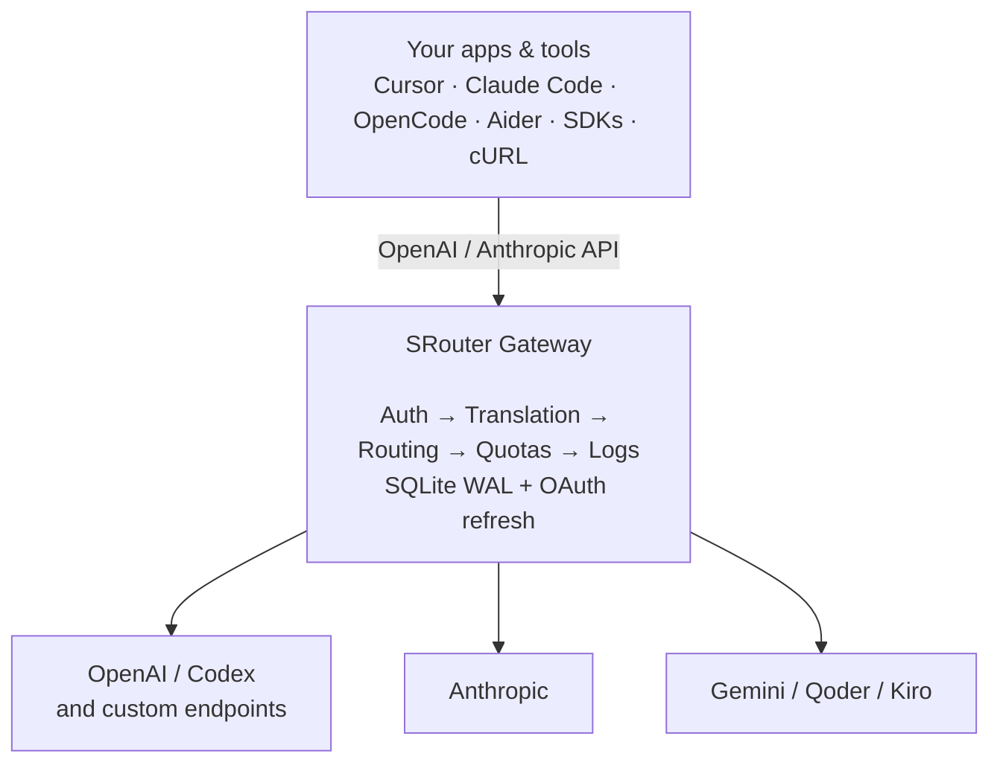
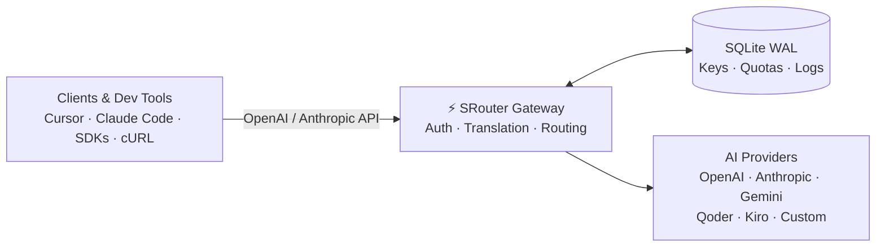

<div align="center">

# ⚡ SRouter

### One gateway for every AI provider you use.

SRouter is a local-first AI gateway and LLM proxy for OpenAI-, Anthropic-, and custom-compatible providers. Keep one stable API while SRouter handles routing, authentication, translation, quotas, and observability.

<p>
  <a href="https://github.com/seaavey/SRouter/releases"></a>
  <a href="LICENSE"></a>
  <a href="https://nodejs.org/"></a>
  <a href="https://www.typescriptlang.org/"></a>
  <a href="https://hono.dev/"></a>
  <a href="https://react.dev/"></a>
  <a href="https://www.sqlite.org/"></a>
</p>

<p>
  <a href="#quick-start">Quick Start</a> ·
  <a href="#supported-providers">Providers</a> ·
  <a href="#cli">CLI</a> ·
  <a href="#integrate">Integrate</a> ·
  <a href="#api">API</a> ·
  <a href="#development">Development</a>
</p>

</div>

---

## What SRouter does

Using multiple AI providers usually means juggling different APIs, authentication flows, rate limits, model names, and client configuration. SRouter gives your tools one gateway and keeps provider-specific complexity in one place.



## Why SRouter?

| Without a gateway                           | With SRouter                                |
| ------------------------------------------- | ------------------------------------------- |
| Different SDK/API shapes                    | One OpenAI + Anthropic compatible interface |
| OAuth tokens expire unexpectedly            | Background token refresh                    |
| Provider quotas are hard to see             | Live quota & reset telemetry                |
| Switching providers requires client changes | Centralized model routing                   |
| Extra Redis/Postgres services               | Embedded SQLite WAL                         |
| Debugging AI requests is painful            | Playground + audit logs                     |

## Capabilities

### One API for many providers

Use OpenAI-compatible `POST /v1/chat/completions` or Anthropic-compatible `POST /v1/messages` and keep your client code stable while switching upstream providers.

### Smart routing and failover

Route across multiple accounts and providers, recover from common upstream errors, and configure fallback rules before streaming begins.

### OAuth that keeps itself alive

SRouter includes background token sweeping and refresh flows for supported OAuth providers, so short-lived sessions do not have to interrupt your traffic.

### Quota visibility

See remaining capacity, token limits, reset timing, and provider health from the dashboard and `/v1/quota`.

### Virtual API keys

Create scoped `sr-live-*` keys for clients, with configurable expiration, rate limits, quotas, and API-key enforcement.

### Token Saver

The `/token-saver` tools can compress noisy developer input, encourage concise model output, and reduce unnecessary token usage across common coding workflows.

### Built-in Playground

Test models directly from the web UI with streaming, parameter controls, session history, reasoning inspection, and code export.

### Built-in Cloudflare Tunnel

Expose your local gateway to the internet without opening ports: install `cloudflared`, start a quick or named tunnel, watch live events over SSE, and optionally bind a custom domain — all managed from the dashboard or `/v1/tunnel`. The tunnel autostarts on reboot if it was left enabled.

### Local-first by design

The core stack uses Hono + native SQLite WAL. No external database is required for the default deployment.

---

## Supported Providers

SRouter supports the following provider families and custom endpoints. Availability of
features may vary by provider and account configuration.

| Provider               | Authentication        | Model prefix     | Streaming |    Quota     |
| ---------------------- | --------------------- | ---------------- | :-------: | :----------: |
| Google Antigravity     | OAuth 2.0 with PKCE   | `antigravity/*`  |    ✅     |      ✅      |
| OpenAI Codex / ChatGPT | OAuth 2.0 with PKCE   | `openai_codex/*` |    ✅     |      ✅      |
| Anthropic Claude       | API key or OAuth      | `anthropic/*`    |    ✅     |      ✅      |
| Qoder                  | Device token or OAuth | `qoder/*`        |    ✅     |      ✅      |
| Amazon Q / Kiro        | AWS SigV4 or API key  | `kiro/*`         |    ✅     |      ✅      |
| OpenCode Zen           | Free / access token   | `opencode_zen/*` |    ✅     |      ✅      |
| Neosantara             | Bearer API key        | `neosantara/*`   |    ✅     |      ✅      |
| GoRouter               | Bearer API key        | `gorouter/*`     |    ✅     |      ✅      |
| BluesMinds             | Bearer API key        | `bluesminds/*`   |    ✅     |      ✅      |
| SeekAI                 | Bearer API key        | `seekai/*`       |    ✅     |      ✅      |
| TabiToken              | Bearer API key        | `tabitoken/*`    |    ✅     |      ✅      |
| TokenRouter            | Bearer API key        | `tokenrouter/*`  |    ✅     |      ✅      |
| Command Code           | Bearer API key        | `commandcode/*`  |    ✅     |      ✅      |
| CodeBuddy              | Access token or OAuth | `codebuddy/*`    |    ✅     |      ✅      |
| Custom endpoints       | Custom                | `custom/*`       |    ✅     | Configurable |

> **Note:** Provider capabilities depend on the upstream implementation and your account.

---

## Quick Start

### Requirements

- Node.js `>=22.0.0`
- pnpm `11.20.0`

### 1. Clone

```bash
git clone https://github.com/seaavey/SRouter.git
cd SRouter
```

### 2. Install

```bash
corepack enable
pnpm install
```

### 3. Configure

```bash
cp .env.example .env
```

### 4. Run

```bash
pnpm dev
```

Then open:

- Dashboard: `http://localhost:5173`
- API Gateway: `http://localhost:3000`
- OAuth callback: `http://localhost:1455`

### 5. Configure a provider

Open the dashboard, go to **Providers**, and authenticate a provider. Then create a virtual API key and test a model from **Playground**.

### 6. Connect coding tools

```bash
pnpm srouter setup
```

For a production-style deployment without a local Node.js setup, use the [Docker](#docker) instructions below.

---

## 💻 CLI

The official `@srouter/cli` helps connect coding tools to your SRouter instance.

```bash
# Interactive setup
pnpm srouter setup

# Check gateway + tool configuration
pnpm srouter status
pnpm srouter doctor

# Link a tool
pnpm srouter link claude --model claude-3-7-sonnet
pnpm srouter link opencode --model claude-3-7-sonnet

# Run a tool with SRouter environment variables
pnpm srouter run claude

# Generate shell exports
eval "$(pnpm srouter env claude)"

# Restore previous tool configuration
pnpm srouter unlink claude
```

You can also run the CLI package directly:

```bash
npx @srouter/cli setup
```

---

## Docker

Pull the pre-built image from GHCR:

```bash
docker run -d \
  --name srouter \
  --restart unless-stopped \
  -p 3000:3000 \
  -p 1455:1455 \
  -v srouter_data:/app/data \
  ghcr.io/seaavey/srouter:latest
```

Or use Compose:

```bash
git clone https://github.com/seaavey/SRouter.git
cd SRouter
docker compose up -d
```

Persistent provider credentials, virtual keys, settings, and audit data live in the SQLite database inside `/app/data` when using the persistent volume.

Useful commands:

```bash
docker compose ps
docker compose logs -f
docker compose down
```

---

## Integrate

SRouter is designed to work with clients that already speak OpenAI or Anthropic APIs.

### OpenAI SDK — Python

```python
from openai import OpenAI

client = OpenAI(
    base_url="http://localhost:3000/v1",
    api_key="sr-live-your_virtual_key",
)

response = client.chat.completions.create(
    model="antigravity/gemini-2.5-flash",
    messages=[
        {"role": "user", "content": "Explain SQLite WAL mode in 2 sentences."}
    ],
    stream=True,
)

for chunk in response:
    print(chunk.choices[0].delta.content or "", end="", flush=True)
```

### OpenAI SDK — TypeScript

```typescript
import OpenAI from "openai";

const client = new OpenAI({
    baseURL: "http://localhost:3000/v1",
    apiKey: process.env.SROUTER_API_KEY || "sr-live-dev-key"
});

const response = await client.chat.completions.create({
    model: "openai_codex/gpt-4o",
    messages: [{ role: "user", content: "Write a high-performance LRU cache in TypeScript." }]
});

console.log(response.choices[0].message.content);
```

### Anthropic SDK — Python

```python
from anthropic import Anthropic

client = Anthropic(
    base_url="http://localhost:3000/v1",
    api_key="sr-live-your_virtual_key",
)

message = client.messages.create(
    model="anthropic/claude-3-7-sonnet",
    max_tokens=1024,
    messages=[{"role": "user", "content": "Hello Claude through SRouter!"}],
)

print(message.content[0].text)
```

### cURL — streaming

```bash
curl -N http://localhost:3000/v1/chat/completions \
  -H "Content-Type: application/json" \
  -H "Authorization: Bearer sr-live-your_key" \
  -d '{
    "model": "antigravity/gemini-2.5-flash",
    "messages": [{"role": "user", "content": "Tell me a joke about asynchronous programming."}],
    "stream": true
  }'
```

### Cursor / Windsurf / Cline / Roo Code / Continue

Use the same SRouter gateway values:

```text
Base URL: http://localhost:3000/v1
API Key:  sr-live-...
Model:    <any discovered SRouter model>
```

---

## API

> All gateway endpoints live under `/v1` (plus unversioned `/health`). Root-level paths such as `/models` or `/chat/completions` are not served by the API — always configure clients with a `.../v1` base URL.

### Core

| Method | Endpoint               | Purpose                                 |
| ------ | ---------------------- | --------------------------------------- |
| `POST` | `/v1/chat/completions` | OpenAI-compatible chat completion + SSE |
| `POST` | `/v1/chat/completion`  | Alias for chat completion               |
| `POST` | `/v1/messages`         | Anthropic-compatible messages           |
| `GET`  | `/v1/models`           | List available models                   |
| `GET`  | `/v1/models/:model`    | Inspect model details                   |

### Management & telemetry

| Method   | Endpoint            | Purpose                       |
| ------ | ------------------- | ----------------------------- |
| `GET`    | `/health`           | Gateway health                |
| `GET`    | `/v1/tunnel/status` | Cloudflare tunnel state       |
| `POST`   | `/v1/tunnel/start`  | Start the tunnel (admin)      |
| `POST`   | `/v1/tunnel/stop`   | Stop the tunnel (admin)       |
| `GET`    | `/v1/tunnel/events` | Live tunnel events (SSE)      |
| `GET`    | `/v1/quota`         | Provider quota + reset timing |
| `GET`    | `/v1/providers`     | List provider connections     |
| `POST`   | `/v1/providers`     | Add/update a provider         |
| `DELETE` | `/v1/providers/:id` | Remove a provider             |
| `GET`    | `/v1/keys`          | List virtual API keys         |
| `POST`   | `/v1/keys`          | Create a virtual API key      |
| `DELETE` | `/v1/keys/:id`      | Revoke a key                  |
| `GET`    | `/v1/settings`      | Read gateway settings         |
| `POST`   | `/v1/settings`      | Update gateway settings       |
| `GET`    | `/v1/logs`          | Request audit logs            |
| `GET`    | `/v1/logs/stats`    | Usage + cost aggregates       |

---

## Configuration

| Variable        | Default                 | Description                            |
| --------------- | ----------------------- | -------------------------------------- |
| `PORT`          | `3000`                  | API server + production dashboard port |
| `OAUTH_PORT`    | `1455`                  | OAuth PKCE callback listener           |
| `DATABASE_PATH` | `~/.srouter/srouter.db` | SQLite database path (in home dir)     |
| `NODE_ENV`      | `development`           | `development` or `production`          |
| `WEB_DIST_PATH` | `apps/web/dist`         | Dashboard static asset path            |

### Database Location

By default, SRouter stores all data (providers, API keys, logs, quotas) in a dedicated folder `~/.srouter/srouter.db` in your user's home directory. This keeps the project root clean and makes backups simpler.

You can override this with `DATABASE_PATH=/custom/path/srouter.db` for development or Docker deployments.

**Legacy support:** If you have an existing database at `apps/api/srouter.db` or `srouter.db` in the project root, SRouter will automatically use that instead of the new location to avoid breaking existing installations.

---

## Architecture



The repository is a pnpm + Turborepo monorepo with separate apps for the API, CLI, and web dashboard plus shared packages for providers, translation, pricing, database access, and domain types.

```text
apps/
├── api/        # Hono API, OAuth, token sweeper
├── cli/        # @srouter/cli
└── web/        # React dashboard

packages/
├── db/         # SQLite WAL layer
├── executors/  # Provider drivers
├── providers/  # Provider registry + OAuth state
├── translator/ # API/schema translation
├── pricing/    # Token pricing + cost estimation
├── constants/  # Shared definitions
└── types/      # Domain models + Zod schemas
```

---

## Resource profile

SRouter is designed to keep the gateway lightweight without sacrificing the convenience of a full dashboard.

### Memory footprint at a glance

| Runtime                        |                        RAM |    Relative footprint |
| ------------------------------ | -------------------------: | --------------------: |
| ⚡ **SRouter API**             |   **65.2 MiB** ≈ **68 MB** |             **1.00×** |
| 🖥️ **SRouter API + Dashboard** | **206.1 MiB** ≈ **216 MB** |    **3.16× API-only** |
| 🔹 **9router API**             | **104.5 MiB** ≈ **110 MB** | **1.60× SRouter API** |

```text
Idle RAM footprint (lower is better)

SRouter API             65.2 MiB  ████████████████████████████████
9router API            104.5 MiB  ██████████████████████████████████████████████████
SRouter + Dashboard    206.1 MiB  ██████████████████████████████████████████████████████████████████████████████████████
                        0 MB        50        100        150        200       216 MB
```

### The takeaway

> **Benchmark note:** These are documented idle-runtime measurements under the tested Node.js environment. RAM usage is environment-dependent; this section describes a footprint profile, not a universal latency benchmark.

### Why the footprint stays small

- Hono keeps the HTTP layer lightweight.
- Native `node:sqlite` + WAL avoids a separate database service.
- API-only deployments can run without the web dashboard.

---

## Development

```bash
# Check formatting
pnpm format:check

# Lint
pnpm lint

# Run tests
pnpm test

# Build everything
pnpm build
```

For targeted package testing, see the individual package test scripts and `CONTRIBUTING.md`.

---

## Roadmap

- [x] Multi-provider OAuth PKCE + background token sweeper
- [x] Real-time quota and rate-limit monitoring
- [x] Configurable API-key enforcement
- [x] React 19 dashboard + Playground
- [x] Anthropic Messages API
- [x] GHCR Docker publishing
- [x] Built-in Cloudflare Tunnel management (SSE events, custom domains)
- [ ] Multi-region upstream load balancing
- [ ] Semantic response caching with local SQLite vector search
- [ ] One-click cloud deployment templates

---

## Contributing

Issues, ideas, and pull requests are welcome.

Start with [CONTRIBUTING.md](CONTRIBUTING.md) for the development workflow and project conventions.

## Security

Please read [SECURITY.md](SECURITY.md) for the security policy and responsible disclosure process.

## License

SRouter is released under the **MIT License**. See [LICENSE](LICENSE).

---

<div align="center">
  <sub>Built for developers who use more than one AI provider.</sub>
</div>
