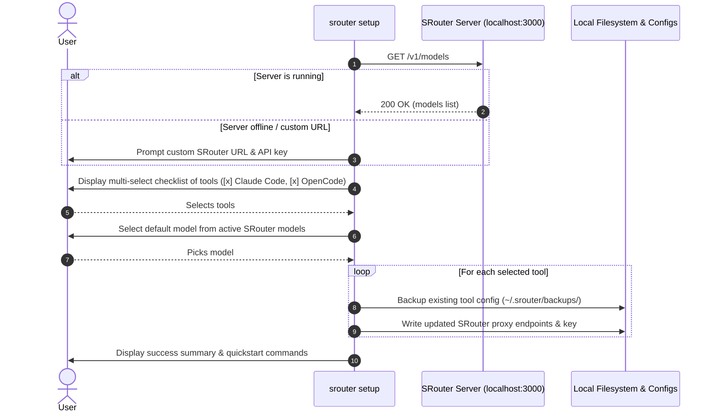

# Design Spec: SRouter CLI (`apps/cli`)

**Date**: 2026-08-19
**Status**: Draft / In-Review
**Target Package**: `apps/cli` (`@srouter/cli`)

---

## 1. Overview & Objectives

`apps/cli` is a command-line interface for the **SRouter** ecosystem. Its primary objective is to streamline the onboarding and automatic configuration of AI coding CLI tools (specifically **Claude Code** and **OpenCode**, with an extensible architecture for future tools) so they seamlessly proxy requests through SRouter's local or remote gateway (`http://localhost:3000/v1`).

### Key Capabilities

1. **Interactive Setup Wizard (`srouter setup`)**: Automatically detects local SRouter health (`/v1/models`), asks for credentials if needed, provides an interactive multi-select checklist of CLI tools to configure, selects the primary model, and applies configuration safely.
2. **Modular Tool Adapters**: Dedicated adapters for **Claude Code** and **OpenCode** that encapsulate tool detection, configuration file mutation, backup/rollback, and environment variable generation.
3. **Direct Subcommands**:
    - `srouter link <tool>`: Directly configure a specific tool with flags (`--url`, `--key`, `--model`).
    - `srouter unlink <tool>`: Safely restore a tool's configuration from pre-link backups.
    - `srouter run <tool> [...args]`: Launch the target CLI tool with injected SRouter environment variables on the fly.
    - `srouter status` / `srouter doctor`: Verify SRouter server connectivity, model catalog, and connection state of all supported tools.
    - `srouter env [tool]`: Output shell export statements for easy sourcing (`eval "$(srouter env)"`).

---

## 2. Directory & File Structure

```text
apps/cli/
├── bin/
│   └── srouter.js                  # Executable entrypoint (#!/usr/bin/env node)
├── src/
│   ├── index.ts                    # Commander CLI entry & command registration
│   ├── commands/
│   │   ├── setup.ts                # Interactive wizard (Clack prompts, multi-select checklist)
│   │   ├── link.ts                 # Direct tool configuration
│   │   ├── unlink.ts               # Revert tool configuration from backup
│   │   ├── run.ts                  # Subprocess runner with injected env vars
│   │   ├── status.ts               # Health & tool status inspector
│   │   └── env.ts                  # Shell export generator
│   ├── adapters/
│   │   ├── base.ts                 # BaseToolAdapter interface & abstract class
│   │   ├── index.ts                # Adapter registry and factory
│   │   ├── claude.ts               # Claude Code adapter (~/.claude.json, ANTHROPIC_BASE_URL)
│   │   └── opencode.ts             # OpenCode adapter (~/.config/opencode/config.json)
│   ├── lib/
│   │   ├── srouterClient.ts        # HTTP client for pinging /v1/models and checking server status
│   │   ├── configStore.ts          # CLI state store & backup indexer (~/.srouter/cli.json)
│   │   └── ui.ts                   # Clack prompts & styling helpers (picocolors)
│   └── types/
│       └── index.ts                # CLI types, adapter contracts, and config schema
├── tests/
│   ├── adapters.test.ts            # Unit tests for Claude & OpenCode adapters
│   ├── configStore.test.ts         # Unit tests for backup and state management
│   └── srouterClient.test.ts       # Unit tests for server health and discovery
├── package.json
├── tsconfig.json
└── tsup.config.ts
```

---

## 3. Tool Adapters Specification

Each tool adapter implements the `BaseToolAdapter` interface:

```typescript
export interface ToolConfigContext {
    baseUrl: string;
    apiKey?: string;
    model?: string;
}

export interface ToolStatus {
    installed: boolean;
    linked: boolean;
    configPath?: string;
    currentBaseUrl?: string;
    currentModel?: string;
}

export interface BaseToolAdapter {
    readonly id: string;
    readonly name: string;
    readonly description: string;

    isInstalled(): Promise<boolean>;
    getStatus(): Promise<ToolStatus>;
    link(context: ToolConfigContext): Promise<{ backupPath?: string }>;
    unlink(): Promise<boolean>;
    getEnv(context: ToolConfigContext): Record<string, string>;
}
```

### 3.1 Claude Code Adapter (`claude`)

- **Target Files**: `~/.claude.json` (or `~/.claude/config.json`).
- **Configuration Fields**:
    - `ANTHROPIC_BASE_URL`: e.g. `http://localhost:3000/v1` (or `http://localhost:3000`).
    - `ANTHROPIC_API_KEY`: SRouter API Key.
    - `model`: Selected model ID (e.g. `claude-3-7-sonnet`, `claude-3-5-sonnet-20241022`, or custom mapped model).
- **Environment Variables**:
    - `ANTHROPIC_BASE_URL`
    - `ANTHROPIC_API_KEY`
    - `ANTHROPIC_MODEL`
- **Backup Location**: `~/.srouter/backups/claude-<timestamp>.json`.

### 3.2 OpenCode Adapter (`opencode`)

- **Target Files**: `~/.config/opencode/config.json` or `~/.opencode.json`.
- **Configuration Fields**:
    - Sets provider endpoint to SRouter base URL and API key.
    - Sets default active model.
- **Environment Variables**:
    - `OPENAI_BASE_URL`
    - `OPENAI_API_KEY`
    - `ANTHROPIC_BASE_URL`
    - `ANTHROPIC_API_KEY`
- **Backup Location**: `~/.srouter/backups/opencode-<timestamp>.json`.

---

## 4. Interactive Wizard Flow (`srouter setup`)



---

## 5. Subcommands Detail

| Command          | Usage                                                               | Description                                                                |
| :--------------- | :------------------------------------------------------------------ | :------------------------------------------------------------------------- |
| `srouter setup`  | `srouter setup`                                                     | Full interactive wizard with tool checklist and auto-configuration.        |
| `srouter link`   | `srouter link <tool> [--url <url>] [--key <key>] [--model <model>]` | Non-interactive or targeted link for a specific tool.                      |
| `srouter unlink` | `srouter unlink <tool>`                                             | Restore tool's previous configuration from backup.                         |
| `srouter run`    | `srouter run <tool> [args...]`                                      | Execute tool with SRouter environment variables injected on the fly.       |
| `srouter status` | `srouter status`                                                    | Check SRouter server status and display status of all tool configurations. |
| `srouter env`    | `srouter env [tool]`                                                | Output shell export variables for eval sourcing.                           |

---

## 6. Safety, Rollback & Testing Strategy

1. **Non-destructive Mutations**: Before touching any existing tool config file, a timestamped snapshot is saved to `~/.srouter/backups/` and registered in `~/.srouter/cli.json`.
2. **Safe Rollback**: `srouter unlink <tool>` restores the exact previous state or gracefully removes SRouter modifications.
3. **Automated Unit Tests**:
    - Tests using Node native test runner (`tsx --test`).
    - Mocking filesystem and HTTP endpoints to verify adapter link/unlink/getEnv behavior and configStore persistence without affecting actual user configs.
